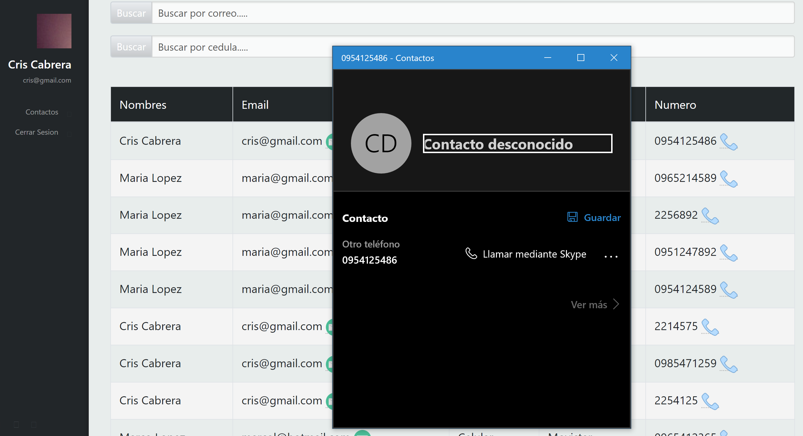
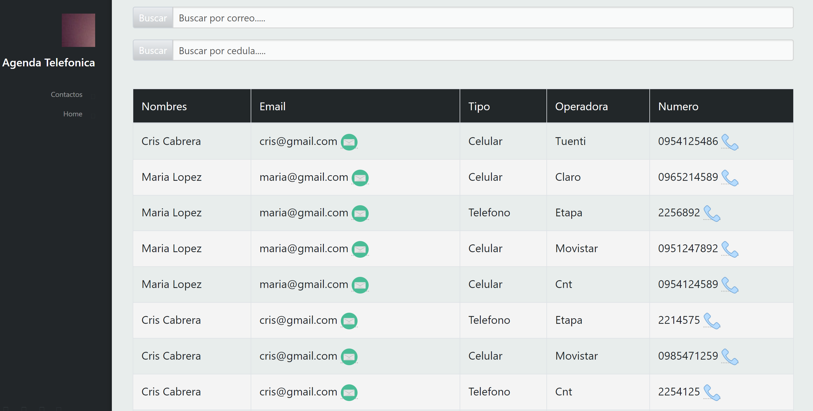

| [./media/image1.png](./media/image1.png)                                                                                                                                                      | **FORMATO DE INFORME DE PRÁCTICA DE LABORATORIO / TALLERES / CENTROS DE SIMULACIÓN – PARA ESTUDIANTES** |                                                                                                                                                                                                  |
|-----------------------------------------------------------------------------------------------------------------------------------------------------------------------------------------------|---------------------------------------------------------------------------------------------------------|--------------------------------------------------------------------------------------------------------------------------------------------------------------------------------------------------|
|                                                                                                                                                                                               |                                                                                                         |                                                                                                                                                                                                  |
| **CARRERA**: COMPUTACIÓN                                                                                                                                                                      | **ASIGNATURA**: PLATAFORMAS WEB                                                                         |                                                                                                                                                                                                  |
| **NRO. PRÁCTICA**:                                                                                                                                                                            | 3                                                                                                       | **TÍTULO PRÁCTICA**: Desarrollo de una aplicación JEE basado en Servlets, JSP y JPA para el intercambio de datos en un modelo de tres capas aplicando los patrones diseño de software MVC y DAO. |
| **OBJETIVO ALCANZADO:** Diseña y desarrolla modelos de software en diferentes niveles de abstracción y modelos de datos a nivel transaccional y analítico con entornos de desarrollo actuales |                                                                                                         |                                                                                                                                                                                                  |
| **ACTIVIDADES DESARROLLADAS**                                                                                                                                                                 |                                                                                                         |                                                                                                                                                                                                  |
| **Crear un repositorio en GitHub con el nombre “Práctica de laboratorio 01: Servlets, JSP y JPA”** https://github.com/damian1998/Practica-de-laboratorio-02-Servlets-JSP-y-JPA.git            |                                                                                                         |                                                                                                                                                                                                  |
| **Desarrollar una aplicación con tecnología JEE para gestionar una agenda telefónica en la web.**                                                                                             |                                                                                                         |                                                                                                                                                                                                  |
| **Realizar varios commits en la herramienta GitHub que demuestren el desarrollo de la aplicación.**                                                                                           |                                                                                                         |                                                                                                                                                                                                  |
| **Generar el informe de la práctica con el desarrollo de cada uno de los puntos descritos anteriormente.**                                                                                    |                                                                                                         |                                                                                                                                                                                                  |
| **Implementar el README del repositorio del proyecto con la misma información del informe de la práctica**                                                                                    |                                                                                                         |                                                                                                                                                                                                  |
| **Subir al AVAC el informe del proyecto en formato \*.pdf. El informe debe contar con conclusiones apropiadas y la firma de cada estudiante**                                                 |                                                                                                         |                                                                                                                                                                                                  |
|                                                                                                                                                                                               |                                                                                                         |                                                                                                                                                                                                  |
|                                                                                                                                                                                               |                                                                                                         |                                                                                                                                                                                                  |
| **RESULTADO(S) OBTENIDO(S)**:                                                                                                                                                                 |                                                                                                         |                                                                                                                                                                                                  |
| **CONCLUSIONES**:                                                                                                                                                                             |                                                                                                         |                                                                                                                                                                                                  |

-   Implementar una agenda telefónica en donde se tendrán usuarios con datos
    como cedula, nombres, apellidos, correo y contraseña.

-   Y cada uno de estos usuarios podrá tener asignado uno o más teléfonos de
    contacto de diferente tipo y operador.

-   Los usuarios pueden registrarse en la aplicación a través de un formulario
    de creación de cuentas.

-   Un usuario puede iniciar sesión usando su correo y contraseña.

-   Una vez iniciado sesión el usuario podrá:

-   Registrar, modificar, eliminar, buscar y listar sus teléfonos

-   Listar los números de teléfono de un usuario usando su número de cédula o
    correo electrónico

-   Podrá llamar o enviar un correo electrónico desde el sistema usando
    aplicaciones externas.

-   Los datos siempre deberán ser validados cuando se trabaje a través de
    formularios.

-   Se pide manejar sesiones y filtros para que existe seguridad en el sistema
    de agenda telefónica.

>   public void doFilter(ServletRequest request, ServletResponse response,
>   FilterChain chain) throws IOException, ServletException {

>   long inicio = System.*currentTimeMillis*();

>   // chain.doFilter(request, response);

>   System.*out*.println("FILTRANDO SESIONES......");

>   System.*out*.print("INFO: Tiempo de Proceso( " +
>   (System.*currentTimeMillis*() - inicio) + " ms)");

>   HttpServletRequest req = (HttpServletRequest) request;

>   HttpServletResponse res = (HttpServletResponse) response;

>   HttpSession sesion = req.getSession();

>   System.*out*.print("Accesos " +
>   String.*valueOf*(sesion.getAttribute("accesos")));

>   System.*out*.print(" IdSesion " + String.*valueOf*(sesion.getId()));

>   if
>   (String.*valueOf*(sesion.getAttribute("accesos")).equals(String.*valueOf*(sesion.getId())))
>   {

>   System.*out*.print("Iguales");

>   chain.doFilter(request, response);

>   } else {

>   System.*out*.print("No Iguales");

>   res.sendRedirect("Login");

>   }

>   }

-   Debe existir una parte pública y una privada.

>   **Privada:**

>   **Publica:**

-   Se obtuvo una aplicación que tiene un funcionamiento óptimo y acorde a los
    requerimientos especificados en la guía de práctica.

-   Se implemento el envió de correos electrónicos desde el sistema a
    aplicaciones externas.

-   Se generaron formularios que validan los datos de acceso.

-   Se manejaron tanto sesiones como filtros para la seguridad del sistema.

-   Se utilizo la

-   El trabajar con DAOS y tener poca con experiencia con estos, ha dificultado
    y **atrasado** de cierta forma el desarrollo de la aplicación.

-   La aplicación cumple con todos los requerimientos pedidos en la guía de
    práctica.

-   Se implementaron Servlets, JSP y JPA en nuestro sistema JEE

-   La API de persistencia JPA es una excelente ventaja a la hora de manipular
    bases de datos relacionales, ya que permite asignar objetos java a dichas
    bases.

**Nombre de estudiante: Christian Zhirzhan**

